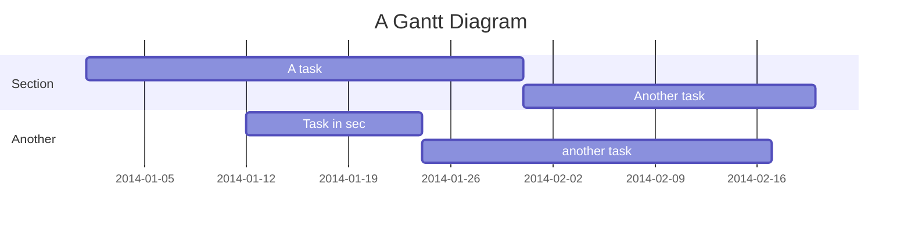

***

title: 面试题复习
date: 2018-05-19
tags:

*   面试
    categories:
*   interview
    author: 尘骁

***

## HTML

### 1. url地址到渲染

1.  DNS解析: 将域名解析为ip地址

*   浏览器缓存
*   系统DNS缓存
*   路由器DNS缓存
*   网络运营商DNS缓存
*   递归搜索 : blog.baidu.com
    *   .com域名下查找DNS解析
    *   .baidu 下查找DNS解析
    *   blog 下查找DNS解析
    *   出错了

1.  TCP连接:   TCP三次握手
    *   第一次握手, 由浏览器发起, 告诉服务器, 我要发送请求了,
    *   第二次握手, 由服务器发起, 告诉浏览器我准备接受了, 开始发送把
    *   第三次握手, 由浏览器发起,  告诉服务器我马上发了, 准备接受吧.
2.  发送请求
    *   请求报文: HTTP协议的通信内容
3.  接受相应
    *   响应报文
4.  渲染页面

*   遇见HTML标记, 浏览器调用HTML解析器解析成TOKEN并构成dom树
*   遇见style/link标记, 浏览器调用css解析器, 处理css并构建cssom树
*   遇到script标记, 调用JavaScript解析器, 处理script代码(绑定事件, 修改dom树/css树)
*   将dom树和cssom树合并成一个渲染树
*   根绝渲染树来计算布局, 计算每个节点的几何信息(布局),
*   将各个节点颜色绘制到屏幕上(渲染)

1.  断开连接: TCP四次挥手

*   第一次挥手, 由浏览器发送给服务器, 我发送完了(请求报文), 你准备关闭吧
*   第二次挥手, 由服务器发送给浏览器, 我接受完了(请求报文), 我准备关闭, 你也准备吧.
*   第三次挥手, 由服务器发送给浏览器, 我发送完了(响应报文), 你准备关闭吧
*   第四次挥手, 有浏览器发送给服务器, 我已经接受完, 我准备关闭了, 你也准备吧.

### 2. 浏览器缓存

#### 2.1 缓存分类

*   强缓存
    *   不会向服务器发送请求, 直接从缓存中读取资源, 每次直接验证本地缓存是否过期
    *   Header设置: Expires过期时间, Cache-Control

*   协商缓存
    *   协商缓存命中, 服务器会将这个请求返回, 但是不会吧这个请求的资源返回, 而是告诉客服端可以从缓存中拿
    *   Header设置: Last-Modified /  If - Modified-Since   /  Etag  /  If-None-Match

*   规则
    1.  首先浏览器在加载资源时, 会根据资源的http header, 判断它是否命中强缓存,如果命中. 浏览器就会从自己的缓存中读取资源, 不会发送请求到服务器.
    2.  当强缓存过期时, 浏览器会发送一个请求到服务器, 通过服务器端返回的其他http header 来判断是否命中了协商缓存,  如果协商缓存命中, 服务器就会返回这个请求, 但是不会返回这个请求对应的资源, 而是告诉浏览器可以从缓存中获取资源.
    3.  当协商缓存也没有命中的时候, 就会直接返回资源, 并且返回的状态码是200, 如果生效就会返回304.

## CSS

### 1. 水平垂直居中

#### 1. 定位实现(3种)

```css
.father {
	position: relative
}
/*
方案一: 绝对定位 + margin为负值
缺点: 得知道具体的宽高
*/
.child {
	position: absolute;
    top: 50%;
    left: 50%;
    margin-top: -100px;
    margin-left: -100px;
}
/*
方案二: 绝对定位 + margin: auto
不用去考虑具体的宽高
*/
.child {
	position: absolute;
    top: 0;
    left: 0;
    right: 0;
    bottom: 0;
    margin: auto;
}
/*
方案三: 绝对定位 + transform: translate(-50%, -50%)
确定: 兼容性
*/
.child: {
    position: absolute;
    left: 50%;
    top: 50%;
    transform: translate(-50%, -50%);
}
```

#### 2. display: flex

*   flex-basis
    *   用于设置子项的占用空间. (该属性用来设置元素的宽度, 如果元素width和flex-basis同时存在, 那么width会被覆盖)
*   flex-grow
    *   用来**瓜分**父项的**剩余空间**. (当父元素宽度比所有子元素宽度之和还要大的时候), 值越大索取的越厉害
*   flex-shrink
    *   用来**吸收**超出的空间(当父元素的宽度小于)

#### 3. display: table-cell

```css
/*
主要用于控制文本,父级必须有固定宽高
*/
.father {
    display: table-cell;
    vertical-align: middle;
    text-align: center;
}
.child {
    display: inline-block;
}
```

### 2. 1px 物理像素实现

*   像素比 = 物理像素 / css 像素 = window\.devicePixeRatio
*   方案一

```js
window.onload = function() {
  var dpr = window.devicePixelRatio;
  // 缩放比例
  var scale = 1 / dpr;
  var width = document.documentElement.clientWidth;
  // 获取meta标签
  var metaNode = document.querySelector('meta[name="viewport"]');
  metaNode.setAttribute(
    "content",
    "width=device-width,initial-scale=" + scale + ", user-scalable=no"
  );
  var htmlNode = document.querySelector("html");
  htmlNode.style.fontSize = width * dpr + "px";
};
```

*   方案二(利用伪元素)

```css
#box {
  width: 200px;
  height: 200px;
  position: relative;
}
#box::before {
  content: "";
  position: absolute;
  left: 0;
  bottom: 0;
  width: 100%;
  height: 1px;
  background: #000;
}
@media screen and (-webkit-min-device-pixel-ratio: 2) {
  #box::before {
    transform: scaleY(0.5);
  }
}
@media screen and (-webkit-min-device-pixel-ratio: 3) {
  #box::before {
    transform: scaleY(0.33333);
  }
}
```

### 3. BFC的理解

*   块级格式化上下文, 一块独立的渲染区域, 只有块级盒子参与, 该区域拥有一套自己的渲染规则, 与外部区域无关
*   **原因**
    *   一个盒子没有设置高度, 子元素在浮动的时候, 无法撑起自身. 这就是没有形成BFC的原因
*   **如何创建**
    *   float的值不为none
    *   postion的值不为static和relative
    *   display的值是inline-block, flex, inline-flex
    *   overflow: hidden
*   **其他作用**
    *   BFC可以取消盒子margin塌陷
    *   BFC可以组织元素被浮动元素覆盖

### 4. 清楚浮动的方式

1.  clear: both, 在最后一个子元素下加一个元素设置clear: both属性. 确定是会增加无用的html元素
2.  使用after伪元素
3.  给父元素设置明确的高度, 确定是并不是所有元素高度都是固定的
4.  给父级元素设置overflow: hidden, 缺点是不能和position配合使用.

## JS

### 1. 面向过程和面向对象



1.  面向过程更注重的时先执行什么后执行什么
2.  面向对象更多的某个角色, 具体能给我们提供什么功能. 面向对象是程序中非常重要的思想, 简而言之就是程序之中所有的操作都需要通过对象来完成.

### 2. 实现Promise

*   异步问题同步化解决方案

#### 1.实现promise的链式调用

```js
// 1. 第一种
class Test () {
    then() {
        return this
    }
}

// 第二种
class Test () {
    then() {
        return new Test()
    }
}
```

#### 2. 代码实现

```js
const State = {
  pending: 'pending',
  resolve: 'resolve',
  reject: 'reject'
}


const noop = () => {}

class MyPromise() {
  constructor(exclutor) {
    this.state = State.pending
    this.resolveArr = []
    this.value = null
    exclutor(this._resolve.bind(this), this._reject.bind(this))
  }
  then() {
    if (this.state === State.pending) {
      const newPromise = new MyPromise(noop)
      this.resolveArr.push({
        promise: newPromise,
        handler: onResolve
      })
    }
    if (this.state === State.resolve) {
      this.handlerResolve()
    }
    return newPromise
  }

  resolve(val) {
    this.value = val
    this.state = State.resolve
    this.handlerResolve()
  }
  handlerResolve() {
    while (this.resolveArr.length) {
      let item = this.resolveArr.shift()
      let nextPromise = item.promise
      let result = item.handler(this.value)
      if (result instanceof MyPromise) {
        result.then((val) => nextPromise.resolve(val))
      } else {
        nextPromise.resolve(result)
      }
    }
  }
  reject(val) {
    this.value = val
    this.state = State.reject
  }
}
export default MyPromise
```

### 3. js综合面试题

```js
// function Foo() {
//   getName = function() {}
//   return this
// }
// Foo.getName = function() { alert (2) }
// Foo.prototype.getName = function() { alert(3) }
// var getName = function() { alert (4) }
// function getName() { alert(5) }

function Foo() {
  getName = function() { alter (1) }
  return this
}
// var getName   函数提升优先级高于变量提升
// function getName() { alert(5) } //  代码执行到后面被后面的重新赋值
Foo.getName = function() { alert (2) }
Foo.prototype.getName = function() { alert(3) }
// getName = function() { alert (4) }
 getName = function() { alter (1) }
// 请写出下列的输出结果
Foo.getName()  //  2
getName()         // 4
Foo().getName() //  1 此时window上的getName被重新赋值 
getName()           // 1
new Foo.getName() // new (Foo.getName)()
new Foo().getName()  // 3  (new Foo()).getName()
new new Foo().getName()
```

### 4. 函数柯里化

*   将函数的多参变为单参

```js
let a = fn(1, 2, 3)
function fn(a) {
  return function (b) {
    return function (c) {
      return a * b * c
    }
  }
}
```

### 5. 闭包

1.  什么是闭包?

*   是个密闭的容器, 存储数据
*   是一个对象, 储存方式为key: value,  closure

1.  形成的条件

*   函数嵌套
*   内部函数引用了外部函数的局部变量

1.  闭包的优缺点

*   优点: 延长了局部变量的生命周期
*   缺点: 内存泄漏

```js
  function fun(n, o) {
    console.log(o)
    return {
      fun: function(m) {
        return fun(m, n)
      }
    }
  }

  var a = fun(0)  // undefined
  a.fun(1)            // 0
  a.fun(2)          // 0
  a.fun(3)          // 0

  var b = fun(0).fun(1).fun(2).fun(3) // undefined,  0,  1,  2

  var c = fun(0).fun(1)
  c.fun(2)
  c.fun(3) // undefined, 0, 1, 1
```

### 6. 变量提升&\&EC

*   js引擎在执行代码之前会做预处理工作
    1.  收集变量
    2.  收集函数
*   执行上下文(execute context)
    *   含义: 代码执行的环境
    *   执行时机: 代码正式执行之前会进入到执行环境
    *   工作:
        1.  创建变量对象
        *   变量
        *   函数以及函数的参数
        1.  确定this的指向
        *   全局: this == > window
        *   局部: this === > 调用其对象
        1.  创建作用域链
            父级作用域链 + 当前变量对象

### 7. 宏任务和微任务

1.  宏任务

*   分类: setTimeout setInterval requestAnimationFrame
*   宏任务队列可以有多个, 执行主线程的js代码

1.  微任务

*   分类: new Promise.then(回调) process.nextTick
*   只有一个微任务队列, 在上个宏任务队列执行完毕后, 如果有微任务就会执行所有微任务.

```js
console.log('--------start-------------')
setTimeout(() => {
  console.log('setTimeout')
}, 0)

new Promise((resolve, reject) => {
  for (var i = 0; i < 5; i++) {
    console.log(i)
  }
  resolve()
}).then(() => {
  console.log('promise实例成功回调执行')
})

console.log('---------end--------------')
```

### 8. 跨域

1.  同源策略

*   浏览器安全策略
*   协议名, 域名, 端口号完全一致

1.  跨域

*   违背同源策略就会产生跨域

1.  解决跨域
    jsonp cors 服务器代理

```js
var script = document.createElement('script')
// 设置回调函数
function getData(data) {
  // 请求回来的数据会被触发
  console.log(data)
}
script.src = 'http://localhost:3000?callback=getData'
document.body.appendChild(script)

```

### 9. nodejs事件轮询

```js
setTimeout(function () {
  console.log('setTimeout()');
}, 0)


setImmediate(function () {
  console.log('setImmediate()');
})

process.nextTick(function () {
  console.log('process.nextTick()');
})

/**
  process.nexTick()
  setTimeout() 
  setImmediate()

nodejs的事件轮询机制: 借助libuv库实现
概括事件轮询机制, 分为6个阶段
 1. timers 定时器阶段
  计时和执行到点的定时器回调函数
2. pending callbacks
  某些系统操作 (例如TCP错误) 的回调函数
3. idle, prepare
  准备工作
4. poll轮询阶段(轮询队列)
如果轮询队列不为空, 依次同步取出轮询队列中第一个回调函数执行, 直到轮询队列为空或者达到系统最大限制
如果轮询队列为空
    如果之前设置过setImmediate函数
            直接进入下一个check阶段
    如果之前没有设置过steImmediate函数
            在当前poll阶段等待
                  直到轮询队列添加回调函数, 就去第一个情况执行
                  如果定时器到点了, 也会去下一个阶段
 5. check查阶段
        执行setImmediate设置的回调函数
6. close callbacks 关闭阶段
        执行close事件回调函数

   process.nexTick 能在任意阶段优先执行       
 */
```

### 10. 冒泡排序

```js
for (let i = 0; i < arr.length - 1; i++) {
  for (let j = 0; j < arr.length - i; j++) {
    if (arr[j] > arr[j + 1]) {
      let temp = arr[j];
      arr[j] = arr[j + 1];
      arr[j + 1] = temp;
    }
  }
}
```

### 11. 隐式转换

*   比较规则
    *   对象和字符串比较 => 调用toString()
    *   undefined == null => 相等
    *   NaN == NaN           => false Nan与自己都不相等
    *   其余都转为数字进行比较

### 12. 单例模式加闭包

```js
var createLogin = function() {
    var div = document.createElement('div')
    div.innerHTML = '我是登录弹窗'
    div.style.display = 'none'
    document.body.appendChild(div)
    return div
}

var getSingle = function(fn) {
    var result
    return function() {
        return result || fn.apply(this, argument)
    }
}

var create = getSingle(createLogin)
document.getElementById('loginBtn').onclick = function {
    var loginLay = create()
    loginLay.style.display = 'block'
}
```

### 13. 继承模式

#### 1. 原型链继承

```js
function Parent() {
    this.info = { name: 'tom' }
}
function Child() {}

Child.prototype = new Parent() 
Child.prototype.contrutor = Child
```

> 弊端:
>
> 1.  多个实例共用一个原型对象, 一旦修改了某一个方法, 其他实例也会受影响
>
> 2.  无法使用super, 对父类进行传参

#### 2. 构造函数继承

```js
function Parent(name) { this.name = [name] }
Parent.prototype.getName = function() {
    return this.name
}
function Child() {
    Parent.apply(this, arguments)
}
```

> 弊端: 并不能继承父类原型上的方法

#### 3. 组合继承

```js
function Parent() {
    this.name = 'xxx'
}
Parent.prototype.getName = function() {
    return this.name
}
function Child() {
    Parent.apply(this, arguments)
}
Child.prototype = new Parent() 
// 4. 继承组合式继承
Child.prototype = Parent.prototype 
// 5. 终极版
Child.prototype = Object.create(Parent.prototype)
Child.prototype.contrutor = Child
```

> 弊端: 每实例化一次, 构造函数就被执行一次

### 14. 实现一个深克隆

```js
function deepClone(obj, hash = new WeakMap()) {
  if (obj instanceof Date) return new Date(obj)
  if (obj instanceof RegExp) return new RegExp(obj)
  if (obj !== null || typeof obj !== 'object') return obj
  if (hash.has(obj)) return hash.get(obj)   
  let t = new obj.constructor()
  hash.set(obj, t)
  for (let key in obj) {
    if (obj.hasOwnProperty(key)) {
      t[key] = deepClone(obj[key], hash)
    } 
  }
}
```

## 框架

### Vue

#### 1. Vue和React的区别

##### 相同点

1.  都有组件化开发和Virtual DOM
2.  都支持props进行父子组件间数据通信
3.  都支持数据驱动视图, 不直接操作真实DOM
4.  都支持服务器渲染
5.  都有支持native的方案, React的React Native, Vue的Weex

##### 不同点

1.  数据绑定: vue实现了数据的双向绑定, react数据流动是单向的
2.  组件写法不一样, React推荐的是jsx, 'all in js' Vue 推荐的做法webpack + vue-loader 的单文件组件格式
3.  state对象在react应用中不可变的, 需要使用setState方法更新状态, 在vue中, 数据是由data属性在vue对象中管理
4.  virtual DOM不一样, vue会跟踪每一个组件的依赖关系, 不需要重新渲染整个组件树,而对于React而言, 每当应用的状态改变时, 全部组件都会重新渲染, 所以react中会需要shouldComponentUpdate这个生命周期来进行控制.
5.  React严格上只针对MVC的view层, Vue则是MVVM模式,

#### 2. Vue组件通信方式

##### 通信种类

*   父到子
*   子到父
*   隔代通信
*   兄弟通信

##### 通信方式

1.  props
2.  vue自定义事件(bus)
3.  消息订阅与发布
4.  vuex
5.  slot
6.  inject / provide

#### 3. Vue的MVVM原理

*   Vue作为MVVM模式的实现库的主要技术
    *   模板解析(实现初始化显示)
        *   解析大括号表达式
        *   解析指令
    *   数据绑定(实现更新显示)
        *   通过数据劫持实现
*   图例
    

#### 4. Vue3.0

##### 1. 为什么要用proxy代替defineProperty?

1.  深度监听, 需要递归到底, 一次性计算量大
2.  无法监听新增删除属性(Vue set Vue delete)
3.  无法监听原生数组, 需要特殊处理

##### 2. Vue3特性

1.  更快
    1.  虚拟DOM重写
    2.  优化slots的生成
    3.  静态树提升
    4.  静态属性提升
    5.  基于proxy的响应式系统
2.  更小: 通过摇树优化核心库体积
3.  更容易维护: typescript + 模块化
4.  更加友好: 跨平台
5.  更容易使用
    1.  改进的typescript支持, 编辑器能提供强有力的类型检查
    2.  更好的调式支持
    3.  独立的响应式模块
    4.  Compostion API

#### 5. 虚拟DOM和DIFF算法

##### 1. 从一个例子认识虚拟DOM

    - 浏览器重新渲染的过程就好比是装修一般, 如果直接拆掉重建的话, 效率较低, 代价高昂, diff算法这个时候起到的作用就是精细化比较, 最小量的更新

##### 2. 实现h函数

```js
import vnode from './vnode'
export default function vnode(sel, data, children, text, elm) {
  return {
    sel, data, children, text, elm
  }
}


export default function h(sel, data, c) {
  if (arguments.length !== 3) {
    throw new Error('传入的参数必须为三个')
  }
    // 传入h('div', {}, 'AAa')
  if (typeof c === 'string' || typeof c === 'number') {
    return vnode(sel, data, undefined, c, undefined)
      // 传入h('div', {}, [h('p', {}, '哈哈')])
  } else if (Array.isArray(c)) {
    let children = []
    for (let i =0; i < c.length; i++) {
      if (!(typeof c[i] === 'object' && c[i].hasOwnProperty('sel'))) {
        throw new Error('传入参数没有包含h函数')
      }
      children.push(c[i])
    }
    return vnode(sel, data, children)
   //传入 h('p', {}, h('span', {}, 'AAA'))
  } else if (typeof c === 'object' && c.hasOwnProperty('sel')) {
    let children = [c]
    return vnode(sel, data, children)
  }
}
```

##### 3. diff算法

###### 1.`key`在diff算法中作用

```js
const vnode1 = h('ul', {}, [
    h('li', {}, 'a'),
    h('li', {}, 'b'),
    h('li', {}, 'c'),
])

const vnode2 = h('ul', {}, [
    h('li', {}, 'd'),
    h('li', {}, 'a'),
    h('li', {}, 'b'),
    h('li', {}, 'c'),
])

/*
	如果d在进行比较的时候会直接将vnode1的a替换成d以此类推. 
	但是加入key属性之后, 就会在比较的时候告诉diff算法它们是同一个节点. 
*/
```

###### 2. patch函数进行更新

**初次patch**(新旧节点不同时)

1.  流程图


1.  代码实现

    ```js
    // 将新节点插入到标杆中
    export default function createElement(vnode) {
        let domNode = document.createElement(vnode.sel)
        // 判断子节点还是是文本
        if (vnode.text !== undefined && (vnode.children === undefined || vnode.children.length === 0)) {
            // 内部文字处理
            domNode.innerText = vnode.text
            // 传入了子节点
        } else if (Array.isArray(vnode.children) && vnode.children.length > 0) {
            for (let i = 0; i < vnode.children.length; i++) {
                let chDom = vnode.children[i]
                // 递归添加子节点元素到目标元素中
                let chDomElm = createElement(chDom)
                domNode.appendChild(chDomElm)
            }
        }
        vnode.elm = domNode
        return vnode.elm
    }


    import vnode from './vnode'
    import createElement from './createElement'

    export default function (oldVnode, newVnode) {
        // 先判断是不是Vnode(第一次传入形式为patch(sel, newVnode))
        if (oldVnode.sel === '' || oldVnode.sel === undefined) {
            // 转换成vnode
            oldVnode = vnode(oldVnode.tagName.toLowerCase(), {}, [], undefined, oldVnode)
        }
        // 判断是不是相同虚拟节点
        if (oldVnode.sel === newVnode.sel && oldVnode.key === newVnode.ley) {
            console.log('相同节点');
        } else {
            console.log('不同节点');
            // 如果不是相同节点, 就将新节点插入, 然后删除旧的节点
            let newVnodeElm = createElement(newVnode)
            if (oldVnode.elm.parentNode && newVnodeElm) {
                oldVnode.elm.parentNode.insertBefore(newVnodeElm, oldVnode.elm)
            }
            oldVnode.elm.parentNode.removeChild(oldVnode.elm)
        }

    ```

**精细化比较**(节点相同时)

1.  流程图

    

2.  代码实现

    1.  新旧节点text不同

    ```js
     if (oldVnode.sel === newVnode.sel && oldVnode.key === newVnode.ley) {
            console.log('相同节点');
            // 此时判断newVnode是否是文本节点
            if (newVnode.text !== undefined && (newVnode.children === undefined || newVnode.children.length === 0)) {
                console.log('newVnode文本节点');
                oldVnode.elm.innerText =  newVnode.text
            } else {
                // 新旧vnode都有children, 这是最复杂的一种情况
                if (oldVnode.children !== undefined && oldVnode.children.length > 0) {

                } else {
                    // 旧的没有children, 新的有children
                    console.log('新节点有children');
                    // 先清空oldVnode的内容
                    oldVnode.elm.innerHtml = ''
                    let children = newVnode.children
                    // 便利插入子节点, dom上树
                    for (let i = 0; i < children.length; i++) {
                        let chDom = createElement(children[i])
                        oldVnode.elm.appendChild(chDom)
                    }
                }
            }
        } 
    ```

    **更新策略**

    1.  新前与旧前
    2.  新后与旧后
    3.  新后与旧前
    4.  新前与旧后

#### 6. vue性能优化

##### 1. 路由懒加载

##### 2. keep-alive缓存页面

##### 3. 长列表性能优化

*   freeze(不用响应式的属性, 使其冻结)
*   虚拟滚动(vue-virtual-scroller)

##### 4. 事件的销毁

##### 5. 图片懒加载(vue-lazyload)

##### 6. 第三方插件按需引入

##### 7. 无状态组件转换为函数式组件

### React

#### React性能优化

1.  PureComponent

*   在props发生变化时会进行, PureComponent会进行浅比较.

### 微前端

#### &#x20;路由分发

*   远程拉取微应用

## 移动端

### 移动端相关概念

1.  基本概念

*   屏幕尺寸, 对角线的长度(厘米)
*   屏幕分辨率: 横纵向上物理像素的个数(物理像素)
*   屏幕密度: 每英寸物理像素的个数
*   视口尺寸: 代表横纵向上css像素的个数(css像素)

1.  4个像素, 3个视口, 2个操作, 一个比例

*   4个像素
    *   物理像素
        *   分辨率, 是屏幕呈像的最小单位
    *   css像素
        *   是web开发者使用的最小单位
        *   一个css像素最终一定会转成物理像素去屏幕上呈像
        *   css像素和物理像素之间的关系
            *   不考虑用户缩放
                *   没有viewport
                    *   这块屏幕横向上占据了多少个物理像素 (横向分辨率)
                    *   这块屏幕横向上占据了多少个css像素 (视觉视口的横向尺寸)
                *   有viewport
                    *   像素比
            *   考虑用户缩放
                *   在不考虑用户缩放的基础上
                    *   放大, css像素占据更多的物理像素
                    *   缩小, css像素占据更少的物理像素
    *   设备独立像素
        *   是设备对接css像素的接口, 当css像素和独立像素关联(width=device-width), 像素比才能发挥作用
    *   位图像素
        *   图片的最小单位
        *   位图像素和物理像素一比一时, 图片才能完美清晰展示
*   3个视口
    *   布局视口
        *   决定页面的布局
    *   视觉视口
        *   决定用户能看到什么
    *   理想视口
        *   设备独立像素所代表的值
*   2个操作
    *   用户
        *   只影响布局视口
    *   系统
        *   影响布局视口和视觉视口
        *   放大
            *   放大一个css像素的面积, 视觉视口的面积变小, 一个css像素包含的物理像素个数变多
        *   缩小
            *   缩小一个css像素的面积, 诗句视口的面积变大,一个css 像素包含的物理像素个数变少
*   像素比
    *   物理像素 / 设备独立像素 (一个方向上物理像素的个数 / 一个方向上css像素的个数)

### 移动端适配

*   rem适配
    *   原理: 改变了一个元素在不同设备占据css像素的个数
    *   优点: 没有破坏完美视口
    *   缺点: css像素到rem之间的转换比较复杂
*   viewport适配
    *   优点: 所见即所得
    *   确定: 没有使用完美视口
        \*原理
    ```js
      (function() {
        var targetW = 640
        var scale = document.documentElement.clientWidth / targetW
        var meta = document.querySelector("meta[name='viewport']")
        meta.content = "initial-scale="+scale+", minimum-scale="+scale+", maximum-scale"+scale+",user-scalabel=no"
      })()
    ```

### 移动端常见问题

1.  ie6最小高度问题
2.  禁止电话和邮箱(利用a标签)
3.  解决连接按钮高亮的问题(`-webkit-tap-highlight-color: raba(0, 0, 0, 0)`)
4.  解决圆角过圆的问题: (`-webkit-appearance: none`)
5.  Font Boosting (会在手机屏幕缩小后看不清文字后, 自动将文字变大, 添加maxHeight)

## nodejs

### 遍历文件夹以及文件

```js
const fs = require('fs')
const path = require('path')

const readDir = (entry) => {
  const dirInfo = fs.readdirSync(entry)
  dirInfo.forEach(item => {
    const location = path.join(entry, item)
    const info = fs.statSync(location)
    if (info.isDirectory()) {
      readDir(location)
    } else {
      console.log(`file" ${location}`);
    }
  })
}

readDir(__dirname)
```

### 模块化的差异

1.  耦合性

*   就耦合性而言, commonJs 耦合性要比AMD要高

1.  动态引入

*   ES6 不支持动态引入(静态引入), commonJs 和 AMD可以动态引入

## 性能优化

### 初始阶段

> 加载优化

#### 1. 首页加载慢

*   **首页加载图片过多**
    *   通过**懒加载**的方式来减少**首屏图片**的加载量
    *   懒加载原理就是监听滚动事件, 如果滚动条距离顶部的距离 === 图片距离顶部的距离, 就将data-src的值赋值给src
    *   小图片过多
        *   纯色小图标用iconfont
        *   彩色小图标用雪碧图
*   **首页请求量过多**
    *   分析: 通过**network**来分析首页加载资源和请求量
        *   requests: 请求数量
        *   resource: 前端资源大小
        *   DOMContentLoaded: 浏览器已经完全加载了HTMl, 其他静态资源并没有下载完(只能看, 不能用)
        *   Load: 浏览器已经加载了所有的静态资源.
    *   通过**Coverage**来查看代码的使用情况
        *   只针对js和css
        *   来查看哪些资源加载了但是没有执行
        *   没有执行的代码考虑使用懒加载
    *   通过**nginx服务器**(可用来做CDN, 用来处理静态资源) 来做**资源文件合并**, 将多个`JavaScript, CSS`文件合并成一个.
    *   从**代码**层面进行优化, 组件使用**按需加载**, 页面路由也使用按**懒加载**.
*   首页请求的**静态资源**(HTML, CSS, JS)

> 结论:  加载慢的问题都是过大过慢

#### 2. 优化图片的做法

1.  使用**熊猫站**对图片进行无损压缩(减少位, 去掉不必要的图片源信息)
2.  使用`base64`进行图片转码
3.  使用`webp`格式

#### 3. webpack打包优化

1.  打包分类
    *   将第三方包, 公共代码包, 非公共代码包进行分包
    *   配合\*\*http缓存(Etag)\*\*进行优化()

#### 4. 实现CDN加速

### 运行阶段

> 渲染优化

1.  造成卡顿的原因:
    *   浏览器上的DOM和BOM都是基于`JavaScript`之上进行开发的
    *   DOM和BOM最终都是要转换成`JavaScript`引擎能够处理的数据
    *   转换的过程很耗时, 尤其是操作DOM
2.  解决原则
    *   减少DOM操作
    *   采用分段渲染, 一次只渲染一屏的数据
    *   使用`window.requestAnimationFrame`来逐帧渲染

## 兼容性

### 移动端

##### 1. js toLocalString 在部分安卓机不支持

*   部分安卓版浏览器没有兼容toLocalString方法

*   解决:

    *
        ```js
        function addThousandthSign (numStr)  {
            var regForm = /(\d{1,3})(?=(\d{3})+(?:|\.))/g;
            return numStr.toString().replace(regForm,"1,");
        }
        ```

##### 2. ios对new Date()的兼容性

*
    ```js
    var d = new Date("2017-08-11 12:00:00")
    // 在safari里new Date() 不支持 '-'连接
    解决: 用正则转换将'-'转换为'/'
    ```

### PC端

#### 1. **上下`margin`重合问题**

**`ie`和`ff`都存在，相邻的两个`div`的`margin-left`和`margin-right`不会重合，但是`margin-top`和`margin-bottom`却会发生重合**

### 总结

​	1. CSS和JS可以通过构建工具的loader帮我们实现向下兼容

## 安全

### 1. CSRF: 跨站请求伪造

    1. 攻击原理: 
      	1. F是网站A的用户, 进行登录认证之后保存了cookie, 
       	2. F进入网站B, 网站B引诱用户F跳转到网站A, 访问时, 浏览器会自动上传Cookie
       	3. 网站A对传来的Cookie进行验证, 则执行接口的动作.
    2. 前提: 
        	1. 网站接口存在漏洞
        	2. 用户在网站A已登录
    3. 防护措施: 
        	1. Token验证: 用户访问网站后, 服务器会自动向本地存入token, 之后访问接口时, 需要回传token.
        	2. Referer验证: 服务器判断站点来源
        	3. 隐藏令牌: 与token类似, 使用方式的差别, 更加隐蔽(比如放在HTTP头部)
        同站点(同域名): 使用cookie的samesite=lax属性, 保证cookie安全
    	不同域名: 使用https request header(白名单)

### 2. XSS: 跨站脚本攻击

1.  攻击原理: 向页面注入合法的脚本(不一定要登录)
2.  攻击方式:
    1.  反射型: 发出请求时, XSS代码出现在URL中, 作为输入传入服务器. 服务器响应之后将内容回传到浏览器, 最后浏览器执行XSS代码
    2.  储存型: 提交的代码储存在服务器端
    3.  防御措施
        1.  编码: 对用户输入的内容进行HTML转义
        2.  过滤:
            1.  移除用户上传的DOM属性
            2.  移除用户上传的Style节点, Script节点
        3.  校正: 使用DOM Parse转换(domParse), 校正不配对的标签, 防止用户输入的内容破坏之前的结构

## 笔试题

### 1. 实现一个LazyMan

```js
LazyMan(‘Hank’);
// 输出:
// Hi! This is Hank!

LazyMan(‘Hank’).sleep(3).eat(‘dinner’)
// 输出:
// Hi! This is Hank!
// //等待3秒…
// Wake up after 3
// Eat dinner~

LazyMan(‘Hank’).eat(‘dinner’).eat(‘supper’)
// 输出:
// Hi This is Hank!
// Eat dinner~
// Eat supper~

LazyMan(‘Hank’).sleepFirst(2).eat(‘dinner’).sleep(3).eat(‘supper’)
// 输出:
// //等待2秒…
// Wake up after 2
// Hi This is Hank!
// Eat dinner~
// //等待3秒…
// Wake up after 2
// Eat supper~

```

> 思路:
>
> 1.  支持链式调用, 首先应该会返回一个实例来实现,
> 2.  最后一行因为`sleepFirst`的出现, 导致它的执行优先级最高, 链式调用的方法不是立即执行的.
> 3.  维护一个执行队列, 每链式调用一次就往队列里面添加一次

*   代码实现

```js
class _LazyMan {
	queue: any[] = [];
	constructor(name: string) {
        this.sayName(name);
        setTimeout(() => {
          this.next();
        })
    }

    next() {
        const fn = this.queue.shift();
        fn && fn();
    }

    _holdOn(time) {
      return () => {
        setTimeout(() => {
            console.log(Wake up after ${time} second)
            this.next()
        }, time * 1000)
      }
    }

    sayName(name) {
        const fn = () => {
            console.log(Hi! This is ${name}!);
            this.next();
        }
        this.queue.push(fn);
    }

    sleep(time: number) {
        this.queue.push(this._holdOn(time));
        return this;
    }

    eat(some: string) {
        const fn = () => {
            console.log(Eat ${some}~);
            this.next();
        }
        this.queue.push(fn);
        return this;
    }

    sleepFirst(time: number) {
    	this.queue.unshift(this._holdOn(time));
    	return this;
    }
}
```

